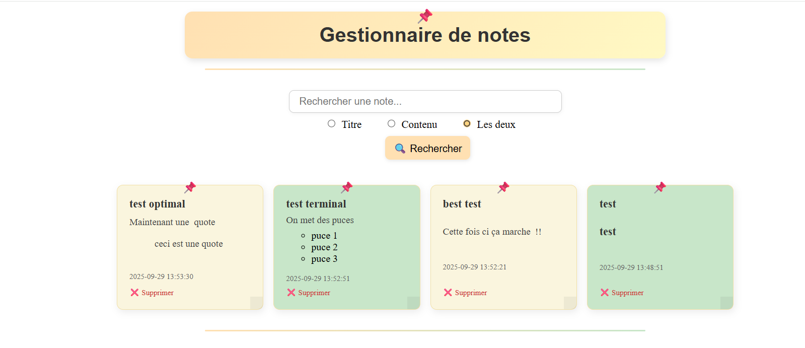
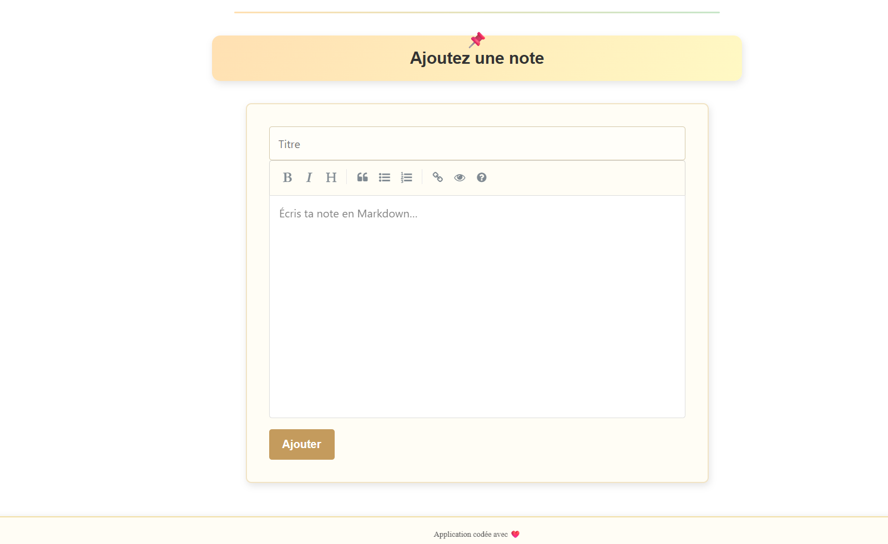
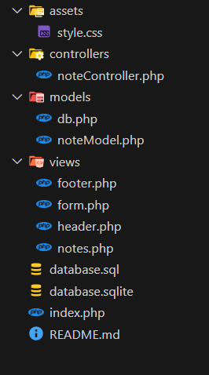

# TRAINING 2 - CDPI - CELINEDEV

## Présentation de l’application

**TRAINING 2** est une application simple et intuitive de prise de notes sous forme de _post-it_.  
L’objectif est de permettre à l’utilisateur d’ajouter rapidement des idées, des tâches ou des mémos, puis de les retrouver facilement grâce à une recherche par **titre** ou **contenu**.

✨ Fonctionnalités principales :

- Ajout de notes via un formulaire clair et rapide
- Affichage des notes avec un design façon _post-it_ colorés pour une meilleure lisibilité
- Recherche instantanée des notes par mot-clé (titre ou contenu)
- Interface minimaliste et efficace pensée pour la productivité

Une application idéale pour organiser ses idées au quotidien, façon tableau de notes numérique.

---

## Pré-requis

- PHP **8.4.10**
- SQLite

---

## Instructions d’installation et de lancement

1. **Cloner le projet depuis GitHub :**
   ```bash
   git clone https://github.com/Celinedev1201/training2.git
   ```
2. **Placer le projet dans votre serveur local**
   par ex. htdocs avec XAMPP ou www avec WAMP
3. **Lancer le serveur local**
   Apache + PHP
4. **Accéder à l’application via votre navigateur**
   exemple : http://localhost/training2

## Captures d’écran de l’application





## Arborescence du projet



## Auteur

Développé avec ❤️ par **theoa.fr**
